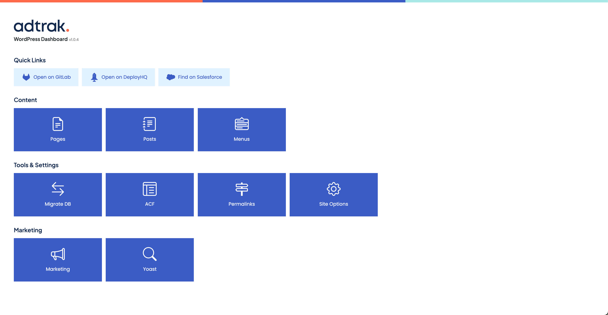

# Adtrak Dashboard

Adtrak Dashboard is a WordPress plugin which replaces the default dashboard with a developer focused one, and features quick access to tools and resources used at Adtrak.

## Table of contents

1. [Screenshot](#screenshot)
2. [Getting Started](#gettingstarted)
3. [License](#license)
4. [Credits](#credits)

## 1. Screenshot

## 2. Getting started

1. Download the [the latest release](https://github.com/EdBartholomew/adtrak-dashboard/releases/latest).
2. Go to the WordPress Admin Panel for your website and click the "Add New" under the "Plugins" heading on the sitebar.
3. Click on "Upload Plugin" followed by "Choose file", then find the file you just downloaded, and click "Install Now".
4. Click on "Activate Plugin".

## 4. License

Adtrak Dashboard is licensed under the [GNU General Public License v3](http://www.gnu.org/licenses/gpl-3.0-standalone.html).

## 5. Credits

Thank you to the following projects.

-   [Bootstrap Icons](https://icons.getbootstrap.com/)
-   [Plugin Update Checker](https://github.com/YahnisElsts/plugin-update-checker)